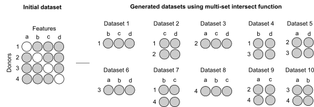

<!-- README.md is generated from README.Rmd. Please edit that file -->

```{r, echo = FALSE}
knitr::opts_chunk$set(
  collapse = TRUE,
  comment = "#>",
  fig.path = "README-"
)
```
<h1>
    # mulset
</h1>

> Is an R package that allows you to generate specific type of multi-set intersections. It searches for multi set intersections between rows and corresponding column identifiers.

## Installation
You need to have [R](https://cloud.r-project.org/) preinstalled on your system.
After you have R installed you can install **mulset** directly from **github** with use of following commands:

```{r gh-installation, eval = FALSE}
install.packages("devtools")
devtools::install_github("LogIN-/mulset")
```

## How it works?

This is a basic example which shows you how to solve a common problem:
Demo data used with an example looks like this:

| outcome | age | gender | Feature 7 | Feature 3 | Feature 4 | Feature 5 | 
|---------|-----|--------|-----------|-----------|-----------|-----------| 
| low     | 77  | male   | NA        | 0         | 28        | 5         | 
| high    | 61  | female | 7         | NA        | 28        | 5         | 
| low     | 58  | female | 91        | 10        | NA        | 18        | 
| high    | 90  | male   | 20        | 0         | 5         | NA        | 

The goal is to create **resamples** from this data above.
---
Such data as shown in example above would produce 10 **resamples** in following way:

|feature_count |features                          |samples |samples_count |datapoints |
|:-------------|:---------------------------------|:-------|:-------------|:----------|
|3             | Feature 3, Feature 4, Feature 5  |1       |1             |3          |
|3             | Feature 4, Feature 5, Feature 7  |2       |1             |3          |
|2             | Feature 4, Feature 5             |1,2     |2             |4          |
|2             | Feature 5, Feature 7             |2,3     |2             |4          |
|2             | Feature 3, Feature 5             |1,3     |2             |4          |
|3             | Feature 3, Feature 5, Feature 7  |3       |1             |3          |
|2             | Feature 4, Feature 7             |2,4     |2             |4          |
|2             | Feature 3, Feature 4             |1,4     |2             |4          |
|2             | Feature 3, Feature 7             |3,4     |2             |4          |
|3             | Feature 3, Feature 4, Feature 7  |4       |1             |3          |


<div style="text-align:center" markdown="1">
	
</div>


## Usage Example
```{r example}
library("mulset")
## Using provided demo data
data(mulsetDemo)
resamples <- mulset(mulsetDemo, exclude = c("outcome", "age", "gender"), 250)

## or from CSV file
## mulsetDemo <-fread("./data/mulsetDemo.csv", header = T, sep = ',', stringsAsFactors = FALSE, data.table = FALSE)
## exclude <- c("come_column")
## resamples <- mulset(mulsetDemo, exclude = exclude, include = c("samples_count", "datapoints"), maxIntersections = 250, hashMethod = "sha1")

```

## Support and Bugs
If you are having trouble, have found a bug, or want to contribute don't be shy.
[Open a ticket](https://github.com/LogIN-/mulset/issues) on GitHub.

## License
**mulset** source-code uses the EUROPEAN UNION PUBLIC LICENCE, see our **LICENSE** file.

## Credits
<div>Icons made by <a href="http://www.freepik.com" title="Freepik">Freepik</a> from <a href="https://www.flaticon.com/" title="Flaticon">www.flaticon.com</a> is licensed by <a href="http://creativecommons.org/licenses/by/3.0/" title="Creative Commons BY 3.0" target="_blank">CC 3.0 BY</a></div>